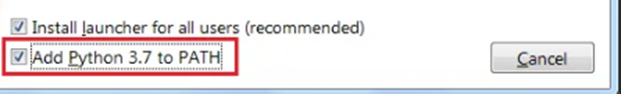
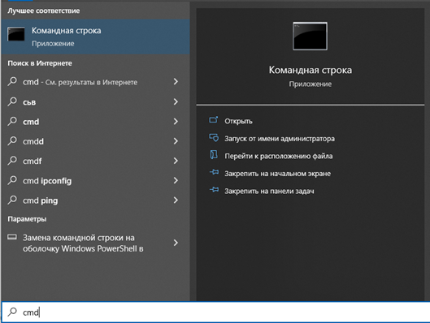
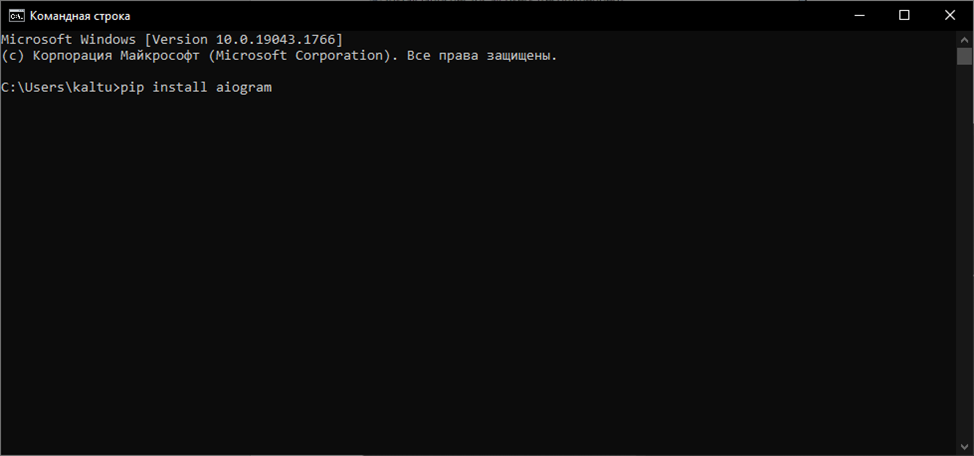
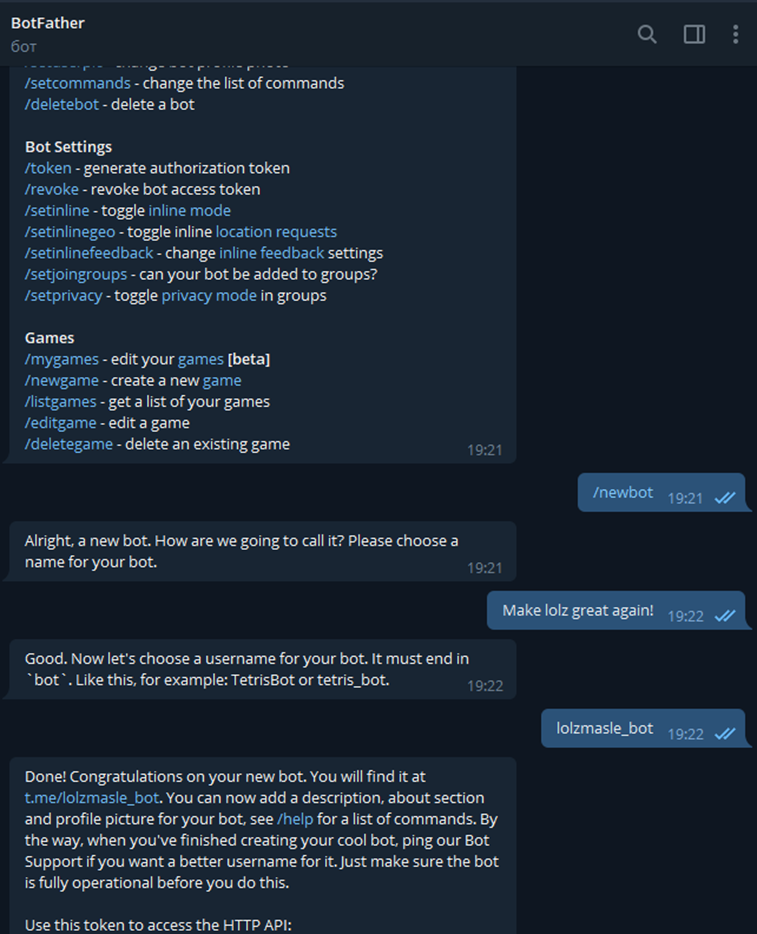

## Скачиваем PYTHON
https://www.python.org/ftp/python/3.9.12/python-3.9.12.exe скрин из инета
Ставим галочку на этом пункте

## Открываем Cmd:

И прописываем по очереди такие команды: 
1.	pip install aiogram
2.	pip install aiosqlite
3.	pip install sqlalchermy
4.	pip install alembic

## Создаем бота в @BotFather 

Нажимаем после создания API TOKEN и копируем.
Заходим в data/config.py
Вставляем нужные данные СТРОГО В КАВЫЧКИ, а где их нет, просто вставляем до знака #
Свой ID можно узнать в https://t.me/FIND_MY_ID_BOT
 
Открываем data/config.py и заполняем нужные данные! 
